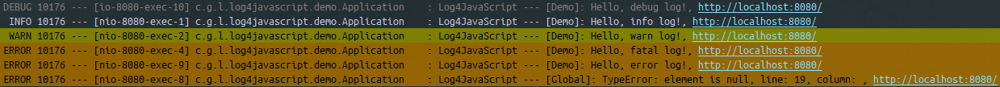

# Log4Javascript Demo

Demonstrate how to send javascript errors to server-side logging system using [log4javascript](http://log4javascript.org/) (1.4.13).

Server-side result:



Snippets:
> demo.js
```js
var log = log4javascript.getLogger("Global"),
  ajaxAppender = new log4javascript.AjaxAppender('/log/javascript');

ajaxAppender.addHeader("Content-Type", "application/json");
ajaxAppender.setLayout(new log4javascript.JsonLayout(false, true));

log.addAppender(ajaxAppender);

window.onerror = function (errorMsg, url, lineNumber) {
  log.fatal(errorMsg + " in " + url + ", line " + lineNumber);
};

...

log.debug("Hello, debug log!");
log.info("Hello, info log!");
log.warn("Hello, warn log!");
log.error("Hello, error log!");
log.fatal("Hello, fatal log!");

```
> index.html
```HTML
<script src="js/log4javascript.js"></script>
<script src="js/demo.js"></script>

<h1>Log4Javascript Demo</h1>

<script>
  var element = document.getElementById('unknown');
  element.innerHTML = '<h1>Demo</h1>';
</script>
```